# Data Privacy and Payments with an API

## Introduction
### Secure PII collection and money movement with Skyflow and Moov

This codelab is an introduction to creating a modern privacy-preserving application that supports secure PII data collection and payments. You’ll use Skyflow’s Data Privacy Vault available as an API and Moov’s payment APIs to create a gig worker app sign up flow and payment experience.

### What you’ll build

Instabread is a fictitious company that supports a marketplace for bread enthusiasts (Instabread clients) to shop for and order bread on-demand from the comfort of their homes. Instabread shoppers receive notifications about orders on their mobile device and travel to the stores to pick up and deliver the bread to the Instabread client. Shoppers are paid based on successful delivery of tasty tasty bread goods.

In this codelab, you’re going to extend the shopper sign up experience to safely and securely store PII data within a Skyflow Vault and transfer money from Instabread to a shopper through Moov.

<p align="center">
  
</p>

### What you’ll learn
* How to use Skyflow Studio to create a data privacy vault.
* How to store and manage PII in a vault with the Skyflow SDKs.
* How to configure a Skyflow Connection between your vault and your Moov account.
* How to use the Moov APIs securely through Skyflow.

### What you’ll need
* A Skyflow trial environment account. If you don’t have one, you can register for one on the [Try Skyflow](https://skyflow.com/try-skyflow) page.
* A Moov account. If you don’t have one, [sign up here](https://dashboard.moov.io/signup).
* A computer with [ngrok](https://ngrok.com/) and [Node.js version 10](https://nodejs.org/en/) or above installed.

> **Note:**
> ngrok is needed to run the project locally. The URL for Instabread must be saved within your Moov developer account in order for the client-side Moov APIs to work.

## Getting set up

### Get the starter code
In a terminal, clone the Instabread sample code to your project’s working directory with the following command:

```shell
git clone https://github.com/thefalc/instabread-codelab-sample
```

### Understand the starter code

Let’s take a look at the starter code structure that you’ll work with throughout the codelab. The project uses the Next.js framework, but even if you’ve never worked with this framework before, you should be able to complete the lab.

Navigate to the [/baseline](/baseline) directory within the repository and view its content. It contains the following elements:

* **components**: This directory contains reusable frontend components.
* **pages**: This directory contains the individual pages used in the Instabread shopper sign up application. [index.js](/baseline/pages/index.js) is where the app begins.
* **pages/api**: This directory contains the backend Node.js code.
* **public**: This directory contains frontend static references like CSS and images.
* **util**: This contains utility files for session management.
* **package.json, package-lock.json**: Configuration files for dependencies and running the application.

### Run the application

1. In a terminal, navigate to your project directory and then the `/baseline` folder and run the application with the following command:

```shell
npm install
npm run dev
```

1. In your browser, navigate to `http://localhost:3000` and you should see the initial Instabread shopper application page.
1. If you click on the **Sign Up** button you’ll be taken to an account creation form. This form is currently not functional, but before you can use the Skyflow client-side SDK to enable the form, you’ll need to setup your Skyflow vault and API credentials.

## Skyflow Studio and API credentials

Skyflow Studio is a web-based application for creating and managing vaults. You can also do all vault operations via APIs, but for this codelab, we’ll make use of the Studio.

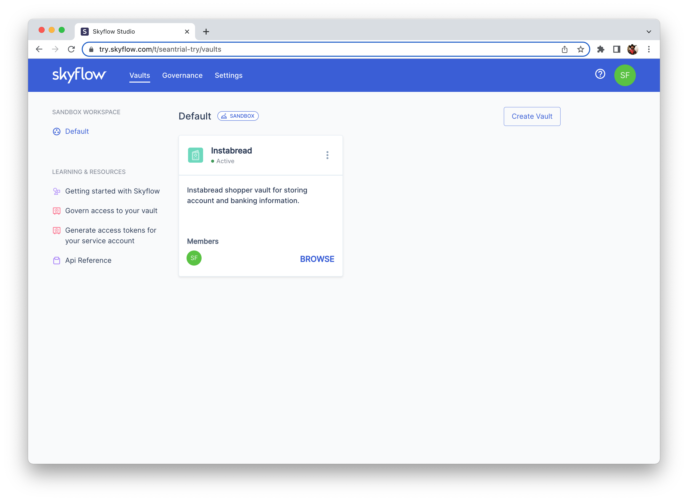

### Create the vault

#### Prerequisites

Before you start,

* Log in to your Skyflow account

#### Create the Instabread vault

The Instrabread vault schema defines the tables, columns, and privacy and security options for secure storage of an Instabread shopper account.

To create the vault

1. In the Vault Dashboard, begin by clicking **Create Vault > Upload Vault Schema**
1. In the modal dialog that opens, drag the [/data/vault_schema.json](/data/vault_schema.json) file onto the dialog and then click **Upload**.
1. In the schema view that’s shown, click the pencil icon next to the default vault title and rename it as &lt;YOUR NAME> Instabread and then click **Create Vault.**

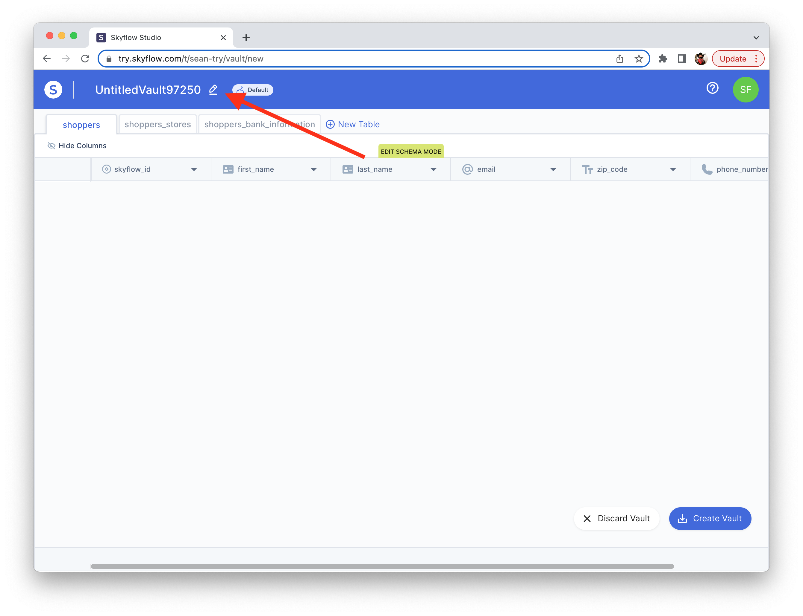

#### Understand the schema

Once the vault is created, take a few minutes to explore the schema. There are three tables:
* **shoppers:** Contains columns representing an Instabread shopper account. This is similar to a traditional “users” or “customers” table in a database.
* **shoppers_stores:** Contains columns representing the locations an Instrabread shopper is willing to travel to.
* **shoppers_bank_information:** Contains columns representing the bank account information for the Instagread shoppers.

> **Note:**
> When defining the schema for a vault, the Skyflow platform supports both basic data types like you'd find in any database as well as pre-defined Skyflow Data Types, which encapsulate common PII elements defined for your convenience. This includes data types like social security number, email, name, address, and credit card. Most of the columns in this schema use the Skyflow Data Types.

In the shoppers table, click on any column header’s down arrow and then select **View column**. You should see a dialog that looks similar to the one below.

<p align="center">
  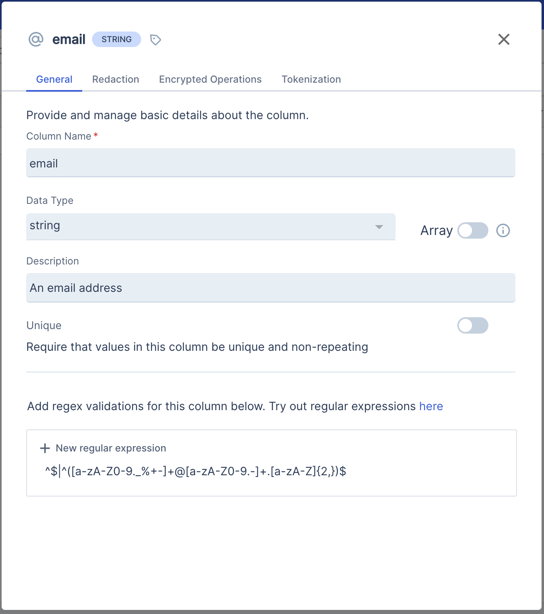
</p>

The dialog has four tabs: **General**, **Redaction**, **Encrypted Operations**, and **Tokenization**.

##### General

The general tab contains the basic details about the column, including the name, description, base data type, whether the values should be unique, and a regular expression for validating new data as it is inserted into the vault. In the case of email, a regular expression is used to automatically validate that new data looks like an email on insertion.

##### Redaction

Redaction is a privacy preservation technique that partially or fully obscures data. In the case of the email column, the data is partially obscured by default using masking. An email like “john.doe@gmail.com” would be masked as “j******e@gmail.com”.

You can modify the masking scheme as needed, but the Skyflow Data Types pre-configure this value for PII where masking is often used.

<p align="center">
  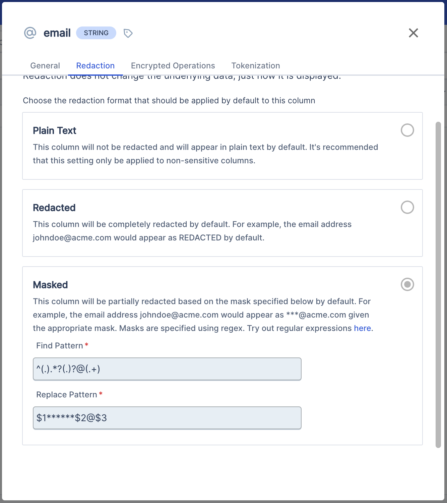
</p>

##### Encrypted Operations

All data within the vault is encrypted at rest and during transit, but through a technique called [polymorphic encryption](https://www.skyflow.com/post/a-look-at-polymorphic-encryption-the-new-paradigm-of-data-privacy), many operations can be performed over fully encrypted data. In the case of the email column, you can perform exact match operations without ever decrypting the data. For numeric fields, comparison and aggregation operations like average and sum are supported.

<p align="center">
  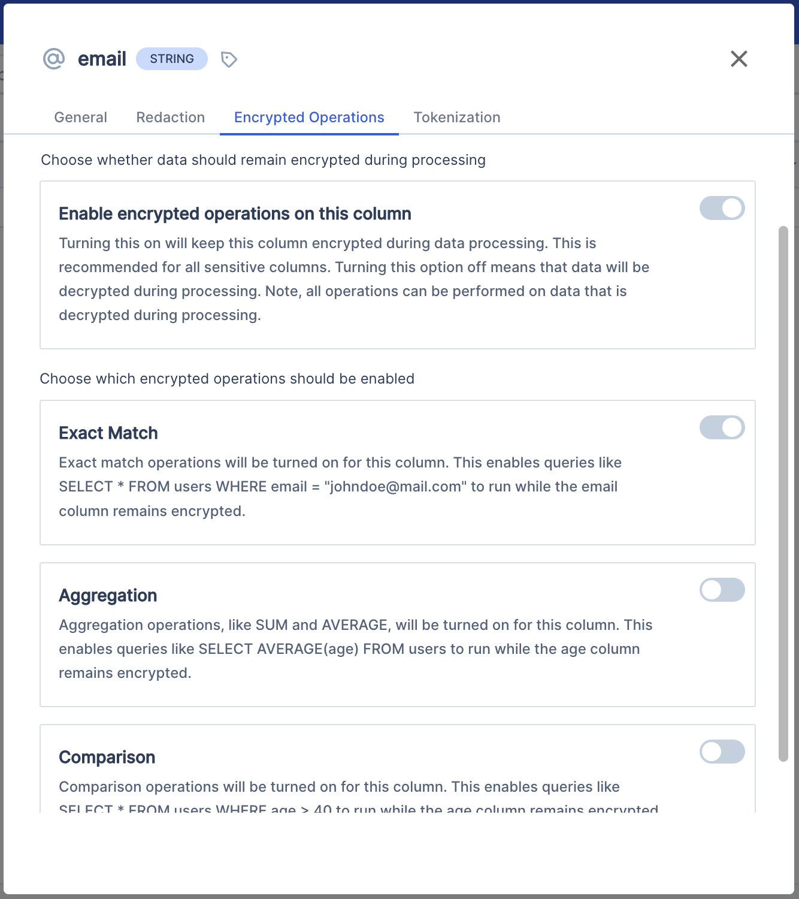
</p>

##### Tokenization

[Tokenization](https://www.skyflow.com/post/demystifying-tokenization-what-every-engineer-should-know) is a privacy-preserving technique that substitutes sensitive data with non-sensitive tokens. Tokens have no exploitable value and can be safely stored within your database and other downstream services. The token can only be exchanged for the original value by privileged services.

For the email column, the default configuration is to use a **Format Preserving Deterministic Token**. This means the token will still look like an email, but not be the actual email.

<p align="center">
  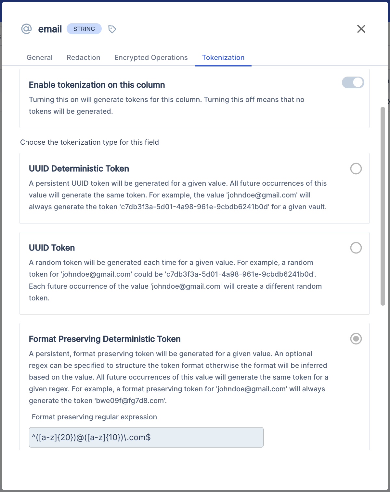
</p>

### Create API credentials

Before jumping into the code, you need to create a role, policy, and service account that will be used for API authentication with the Skyflow APIs.  

1. From the vault schema view of your vault, click the gear icon next to the name of your vault and then click **Edit Settings**.

<p align="center">
  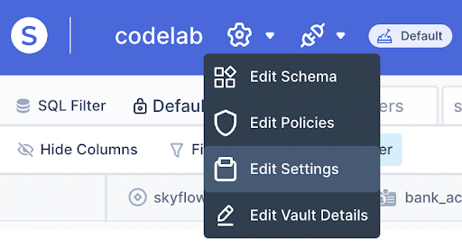
</p>

1. Click **Roles**, then click **Add New Role**.
1. Enter "Client SDK" for **Name**, enter a description, then click **Create**.
1. Click **Attach Policies**, then replace the placeholder content with the following policies:

```
ALLOW CREATE ON *.*
ALLOW TOKENIZATION
```
1. Click **Create**, enter "Client SDK" for the policy name, then click **Save**.
1. Click **Enable**, then close the dialog window.
1. Click **Service Accounts** in the side navigation, then click **New Service Account**.
1. For **Name**, enter "&lt;Your Name> - Client SDK". For **Roles**, choose **Client SDK**.
1. Click **Create**. \
Your browser downloads a `credentials.json` file containing your service account key. Store this file in a secure and accessible location. You will use it exclusively to provide access tokens for API calls from the client-side SDK.

> **Tip:**
> When creating roles and policies and granting access to your vault, keep the following best practices in mind:
> * Differentiate between user and application accounts.
> * Ensure your service accounts and user permissions follow the principle of least privilege. In other words, give the lowest privileges possible so that access is granted only for necessary permissions.
> * Create separate service accounts for administration and for application runtime.

#### Configure the API credentials

The source code for the Instabread application assumes the service account key is available in an environment variable called SERVICE_ACCCOUNT_KEY. Before extending the application, we need to create this environment variable.

1. Open a terminal.
1. Enter the command

    ```shell
    export SERVICE_ACCOUNT_KEY='<CONTENTS FROM credentials.json>'
    ```

> **Note:**
> In a real deployment, your service account key should be stored with a secrets manager and retrieved from a service that has privileged access to the secrets store.

## Account creation

In this section, you will collect the Instabread shopper account information and send it securely to your vault using the Skyflow client-side SDK.

### Understanding the code

1. Open the [components/Layout.js](/baseline/components/Layout.js) file. This file is used by every client-side page for creating the base HTML for the page layout.
1. At the top of the file, there’s a function called `getBearerToken`. This function calls the server endpoint `api/skyflow-token`, which uses your service account key to generate an access token that your client-side code can use to call the APIs for your vault. You don’t need to do any updates or modifications to this file.
1. Open the [pages/sign-up.js](/baseline/pages/sign-up.js) file. This file is the frontend for the shopper account creation page.
1. Scroll down to a function called `signUpHandler`. This function is invoked when the **Create account** button is clicked.

### Configure the Skyflow Client

Currently, when the `signUpHandler` function is invoked, it shows an alert to the user informing them that this functionality doesn’t exist yet. You are going to update this function to send the collected data to your vault. To update the [pages/sign-up.js](/baseline/pages/sign-up.js) file, follow these steps:

1. Remove the line starting with `alert`.
1. Copy the code below and paste it into the `signUpHandler` below the `event.preventDefault()` line.

```javascript
const skyflowClient = Skyflow.init({
  vaultID: process.env.vaultID,
  vaultURL: process.env.vaultURL,
  getBearerToken: getBearerToken,
  options: {
    env: Skyflow.Env.DEV
  }
 });
```

This code block initializes the Skyflow client object. The first two parameters are expecting your vault ID and vault URL values. You need to update the environment variables with your vault details.

> **Tip:**
> You can find the vault ID and vault URL values in the Edit vault details section of your Instabread vault.

1. Navigate to the baseline directory and open the [next.config.js](/baseline/next.config.js) file. You should see the following:

```javascript
module.exports = {
 env: {
   vaultID: '<VAULT_ID>',
   vaultURL: '<VAULT_URL>',
 },
}
```

1. Replace the vault ID and vault URL values with the values for your vault.
1. Save the file.

### Inserting data into the vault

Navigate to the pages directory and open [pages/sign-up.js](/baseline/pages/sign-up.js). After the `skyflowClient` initialization, copy and paste in the code below.

```javascript
let response = await skyflowClient.insert({
  records: [
    {
      fields: {
        first_name: this.state.fname,
        last_name: this.state.lname,
        email: this.state.email,
        zip_code: this.state.zipcode,
        phone_number: this.state.phone,
      },
      table: 'shoppers'
     }
   ]
 }, { tokens: true });
```

The state object contains the form field values entered by the shopper. This code uses the Skyflow client to insert a single record into the shoppers table with the values collected from the form.

Because the parameter `{ tokens: true }` is passed in the call as an option to the insert function, tokenized values will be returned by the API and are part of the response object.

Before testing the code, copy the line below and paste it beneath the insert call. This line will show an alert with the JSON string returned from the API once the inserted record is stored in the vault.

```javascript
alert(JSON.stringify(response));
```

### Testing the account sign up

1. From the same terminal that you exported the SERVICE_ACCOUNT_KEY variable, enter the following command.
```shell
npm run dev
```
1. Navigate to `http://localhost:3000` in your browser.
1. Click the **Sign Up** button.
1. Fill in all fields in the form. There’s currently no client-side form validation, so make sure you fill in everything.
1. Click **Create Account** and once the call is complete, you should see an alert message on your screen containing the JSON response from the API similar to the image below.

<p align="center">
  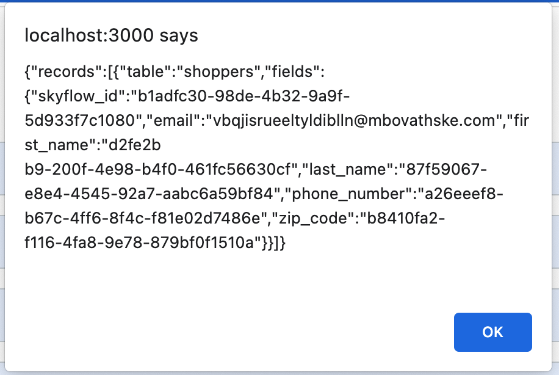
</p>

1. Go back into Skyflow Studio to your vault schema view and you should now see a record inserted into your vault. If you were already in this view, you may need to refresh the table to see the new record.

### Saving the tokenized data

The last thing you need to do is pass the newly created `skyflow_id` and token data for the account to the server to be stored in the session. These values will be required later for other parts of this lab.

Back in the [pages/sign-up.js](/baseline/pages/sign-up.js) file in the `signUpHandler` function, find the line starting with `alert` and replace it with the following code.

```javascript
// Call sign-up passing in record object.
const res = await fetch('/api/sign-up', {
  body: JSON.stringify(response.records[0]),
  headers: {
    'Content-Type': 'application/json'
  },
  method: 'POST'
});

const result = await res.json();
if(result.ok === true) {
  window.location.href = '/about-instabread';
}
```

The fetch call passes the tokenized data to the server endpoint `api/sign-up`.

If you open the [pages/api/sign-up.js](/baseline/pages/api/sign-up.js) file and inspect the handler, you’ll see that this code receives the data and stores the `skyflow_id` and tokenized data to a user session variable.

> **Note:**
> In a real application, you would likely store the skyflow_id and tokens in your application database and downstream services to be referenced and used later. For simplicity of this lab, we'll rely on session memory to play this role.

Try testing the sign up form again. This time the shopper record will be saved to the vault and you’ll be taken to a new screen telling you about the Instabread experience.

## Grocery store selection

In this section, you will collect information about which stores the shopper is willing to travel to do bread pickups.

### Understanding the code

1. Open the file [pages/choose-stores.js](/baseline/pages/choose-stores.js). This file contains the frontend code for displaying the store selection page.
2. Scroll down to the function `initStores`. This function calls the backend endpoint `api/list-stores` to read the list of possible stores. If you look at [pages/api/list-stores.js](/baseline/pages/api/list-stores.js), you can see the handler simply returns a static list of stores. In an actual application, these stores would be based on the location of the shopper account and likely pulled from an application database.
3. Scroll to the `chooseStoreHandler` function. This function is called when the **Continue** button is clicked. Currently, this function takes the selected store IDs and maps them to full store details in the static store list, creating a sublist of stores. The `storeMapping` object is the resulting list of records that need to be written to the shoppers_stores vault table.

### Inserting data into the vault

1. In the `chooseStoreHandler` function, remove the line beginning with `alert`.
1. Below the for loop used to initialize the `storeMapping` object, initialize the Skyflow client with the following code as you did earlier.

```javascript
const skyflowClient = Skyflow.init({
  vaultID: process.env.vaultID,
  vaultURL: process.env.vaultURL,
  getBearerToken: getBearerToken,
  options: {
    env: Skyflow.Env.DEV
  }
});
```

1. After the Skyflow client object is initialized, you need to insert the `storeMapping` records. To do this, add the following lines below the client initialization.

```javascript
await skyflowClient.insert({ records: storeMapping });
window.location.href = '/banking-info';
```

The first line inserts the array of store mappings and the second line moves the sign up screen forward to the banking collection screen.

### Testing the result

1. From the same terminal that you exported the SERVICE_ACCOUNT_KEY variable, enter the following command

```shell
npm run dev
```

1. Navigate to `https://localhost:3000` in your browser.
1. Click the **Sign Up** button.
1. Fill in all fields in the form. There’s currently no client-side form validation, so make sure you fill in everything.
1. Click **Create Account** and once the call is complete you’ll be taken to a screen showing you how Instabread works. If you don’t see a screen like this, then there may be an error in the client side code to create the account. Go back to the [Saving the tokenized data](#saving-the-tokenized-data) section and make sure you have the correct code for the sign up page working before moving on.

<p align="center">
  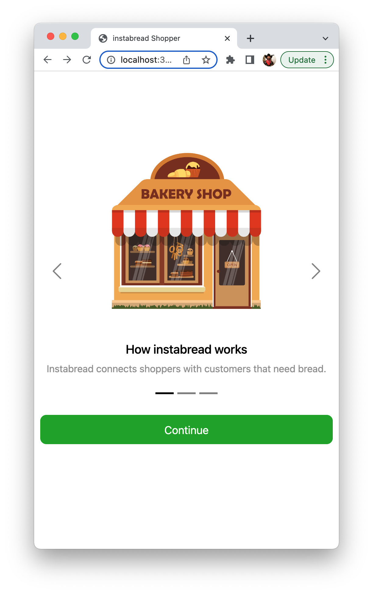
</p>

1. Click the **Continue** button.
1. On the shopper requirements page, click the **I meet the requirements** button.
1. You should now see a screen similar to what’s shown below.

<p align="center">
  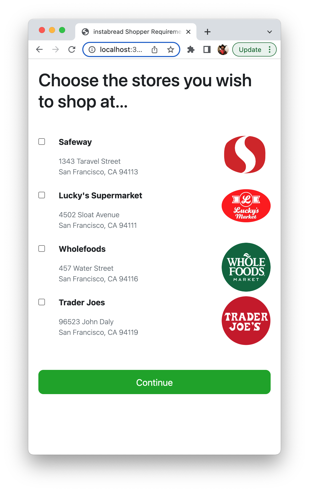
</p>

1. Select at least one option and then click **Continue**.
1. Once the screen shows the direct deposit page, go back to Skyflow Studio and to your vault schema view. Click the tab for the shoppers_stores table and you should see one to four records there depending on how many you selected.

## Connecting Skyflow to Moov

Congratulations on making it this far!

You have successfully collected PII from the Instabread shopper application in a secure way by sending it directly from the frontend to your data privacy vault. Your backend system is completely de-scoped from ever touching any of this sensitive data.

The next step is for you to collect banking information from the shopper, securely store it, passing relevant information to Moov and then use Moov’s money movement APIs to pay the shopper. The first step to this process is to create a Skyflow Connection to Moov.

### Creating a Skyflow connection

Skyflow Connections is a gateway service that uses Skyflow’s underlying tokenization capabilities to securely connect to first party and third party services. This way, your infrastructure is never directly exposed to sensitive data, and you offload security and compliance requirements to Skyflow.

We need to create a connection between Skyflow and Moov so we can pass stored PII to Moov without exposing our backend to the plaintext values.

To create the connection:

1. Go back to Skyflow Studio and from your vault’s schema view, click the gear icon next to the name of your vault and then click **Edit Settings**.
1. Click **Connections** > **Create Connection** > **Start from scratch**.
1. Name the connection “Moov” and provide a description if you like.
1. Select **Outbound Connection** as the connection mode.
1. Set the Outbound Base URL to [https://api.moov.io](https://api.moov.io)
1. Click **Continue**.

#### Configure the Moov account route

We need to create two routes, one for creating a Moov account and the other for passing bank account data to Moov. Let’s start with the Moov account.

To create an individual account with Moov directly, an API call looks similar to the following.

```javascript
curl -X POST 'https://api.moov.io/accounts'
  -H 'Authorization: Bearer {token}' \
  -H "Content-Type: application/json" \
  -H "Origin: https://api.moov.io" \
  -data-raw '{
    "accountType": "individual",
    "profile": {
      "individual": {
        "name": {
           "firstName": "John",
           "lastName": "Doe",
        }
        "email": "john.doe@email.com",
      }
    },
    "capabilities": ["transfers"]
  }'
```

We will create a route that has a similar structure but instead of accepting the plaintext values for `firstName`, `lastName`, and `email`, the API will expect Skyflow tokens.

1. Enter the route details including the name, description, path, method, and content type.
    1. **Name**: Enter “Moov Account Creation”.
    1. **Path**: The path value is `/accounts`. When combined with the outbound base URL, this maps to Moov’s API with the full path URL as [https://api.moov.io/account](https://api.moov.io/account)
    1. **Method**: Skyflow connections support the following http methods: PUT, POST, PATCH, GET, DELETE. For the Moov account API, use the **POST** method.
    1. **Content Type**: Skyflow connections support the following content types: JSON, XML, X_WWW_FORM_URLENCODED. For Moov, use the JSON content type.
1. Scroll down the page and complete the route mappings for the request body.

    The request body is where you configure the specific fields in the request that Skyflow will process. Currently, Skyflow supports two actions that can be performed on a field: **Tokenization** and **Detokenization**.

    For this route, configure the connection to detokenize the request and extract the values associated with three fields: `profile.individual.name.firstName`, `profile.individual.name.lastName`, and `profile.individual.email` similar to the image below.

<p align="center">
  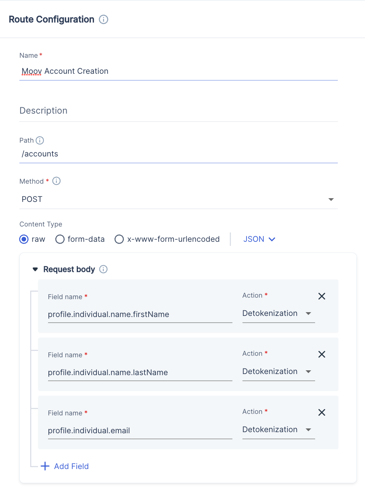
</p>

1. For this example, a response body will not be added. Click **Continue** and then **Create Connection**.

#### Authenticate the connection-level service account

To authenticate to a connection endpoint and invoke it, Skyflow requires you create a dedicated service account with the **Connection Invoker** role assigned to it. This keeps the identity of the client consuming the connection endpoint different from the identity of the service account or the user creating the connection.

Additionally, this means the service account can only make requests to the specific connection. It has no direct read or write access to the data in the vault.

1. Enter a name and description for your new service account like “&lt;Your Name> Moov Service Account”.
1. Click **Create service account**.
1. Your browser downloads a credentials.json file containing your service account key. Store this file in a secure and accessible location.
1. Click **Finish**.

#### Configure the Moov bank account route

Before you head back to the Instabread code, you need to create one more route to support bank account creation.

1. From the **Connections** UI, find the Moov connection and click **Edit**.

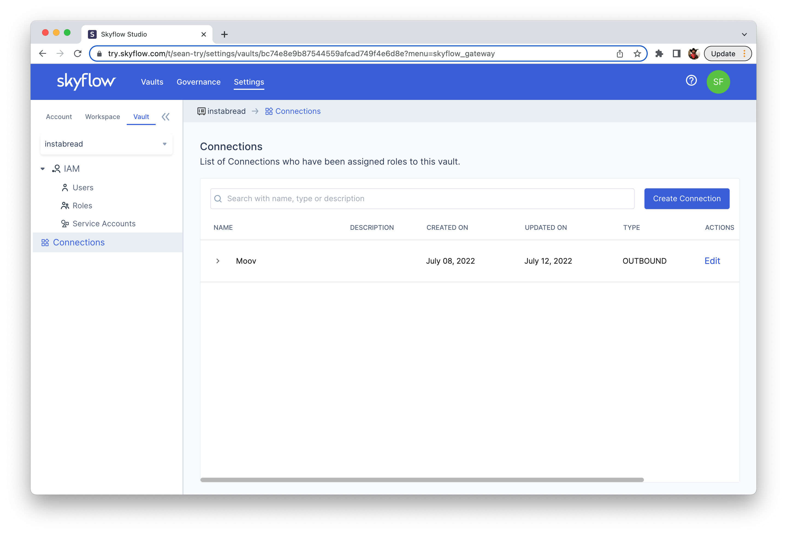

1. Click the **Route** tab and then **+ Add route**.
1. Enter the route details including the name, description, path, method, and content type.
    1. **Name**: Enter “Moov Bank Account Creation”
    1. **Path**: `/accounts/{account_id}/bank-accounts`
    1. **Method**: Use the **POST** method.
    1. **Content Type**: Raw and JSON.
1. Scroll down the page and complete the route mappings for the **Request body**.
    For this route, configure the connection to detokenize the request and extract the values associated with three fields: `account.holderName`, `account.accountNumber`, and `account.routingNumber` similar to the image below.

<p align="center">
  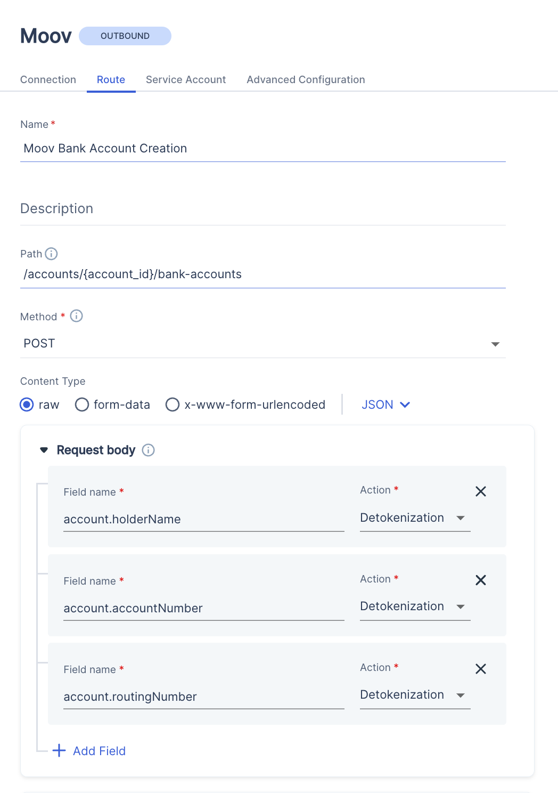
</p>

1. Click **Save Route** and then click **Save **to save the connection.

#### Configure your connections service account for Instabread

Your Skyflow connection and routes are all set. In order for Instabread to be able to call the routes you created, you need to create another environment variable for the connections-specific service account key credentials file you downloaded.

1. In the terminal where you’ve been running your Instabread application, stop the application if it is currently running.
1. Enter the command
    ```shell
    export CONNECTIONS_SERVICE_ACCOUNT_KEY='<CONTENTS FROM CONNECTIONS-SPECIFIC credentials.json>'
    ```
1. This service account key will be used later to invoke the connection to Moov to create the shopper’s Moov account and register their banking information.

### Configure Moov API

Before you can complete the next coding step of the lab, you need to collect a few items from your Moov account and configure them to be used by the Instabread application.

#### ngrok

In order to configure your Moov developer API key, you need to be able to give a domain to Moov in which the API calls will take place. To do this locally, you need to install ngrok.

Once installed, in a new terminal window different than where you were running the Instabread sample, execute the following command to start ngrok:

```shell
ngrok http 3000
```

You should see something similar to the image below. If your Instrabread sample is currently running, you should be able to navigate in your browser to the forwarding address shown by ngrok.

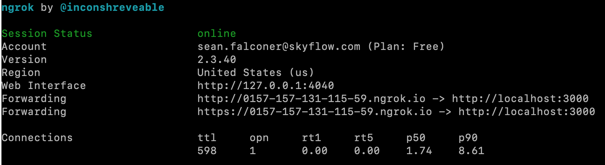

### Moov developer account

1. Navigate to [https://dashboard.moov.io/signin](https://dashboard.moov.io/signin) and login with your Moov account credentials
1. In the left navigation, click on **Developers** > **New API Key**.
1. Enter a name and paste in your ngrok https URL.
1. Click **Create API key**.
1. You’ll be shown a **Public key** and **Secret key**.
1. Copy the Public key and in the terminal running Instabread, stop the application from running and then type `export MOOV_PUBLIC_KEY=<COPIED PUBLIC KEY>`
1. Copy the Secret key and in the same terminal type `export MOOV_SECRET_KEY=<COPIED SECRET KEY>`
1. Copy your ngrok https URL and in the same terminal type `export MOOV_DOMAIN=<COPIED ngrok URL>`

> **Note:**
> In a real deployment, your API keys should be stored with a secrets manager and retrieved from a service that has privileged access to the secrets store.

#### Moov business account details

The last thing you need is your Moov business account details. This will be used to transfer money from your business account to your gig workers.

1. In the Moov admin dashboard, click the **Settings** in the left navigation.
1. Under **Business details**, copy the **Account ID**.
1. In your Instabread terminal, create one more environment variable for this value by executing `export MOOV_BUSINESS_ACCOUNT_ID=<COPIED MOOV BUSINESS ACCOUNT ID>`

## Moov account and bank registration

In this section you will collect the Instabread shopper bank information, use the Skyflow connection you created to securely create a Moov account for the shopper and register their bank information.

### Creating the Moov account

The first thing you will do is update the client-side code to call the server to create the Moov account and update the server-side code to call one of the routes you configured in Skyflow Studio.

#### Understanding the code

1. Open the [pages/banking-info.js](/baseline/pages/banking-info.js) file. This file is the frontend for the shopper bank information entry.
2. Scroll down to a function called `bankingHandler`. This function is invoked when the **Continue** button is clicked.
3. Currently when this function is invoked, it shows an alert to the user informing them that this functionality doesn’t exist yet. You are going to update this function to send the collected data to your vault.

#### Using the route to create the Moov account

1. Remove the line starting with `alert`.
1. Copy the code below and paste it into the `bankingHandler` below the `event.preventDefault()` line.

```javascript
// Create the Moov account.
const result = await fetch('/api/moov-account-creation', {
  headers: {
    'Content-Type': 'application/json'
  },
  method: 'POST'
});

const payload = await result.json();
let skyflowId = payload.skyflowId;

// Account was successfully created.
if(result.ok === true) {
  // TODO
}
```

The code is calling the endpoint `/api/moov-account-creation`, which is going to do the heavy lifting for using the Skyflow connection API to create the Moov account.

1. Open [pages/api/moov-account-creation.js](/baseline/pages/api/moov-account-creation.js). This file contains the server-side code to create the Moov account using only the tokenized data. At the top of this file you can see that the Moov SDK is being initialized with the environment variables you configured previously.
1. Scroll down to the line beginning with `const body = {`. This defines the body of the payload that will be passed to the route you configured. The `firstName`, `lastName`, and `email` are using the tokens you stored in the user session variable after a shopper registers their account.
1. The next two lines create authentication tokens for Moov and Skyflow. These are both needed to make the connections API call. The Skyflow token is used to authenticate your request to the connections API and the Moov token is used for Skyflow to call Moov on your behalf.
1. Find the line that starts with `let connectionsRouteUrl`. You need to update this URL with the route you created earlier for Moov account creation.

#### Connection route URL

1. Go back to Skyflow Studio and from your vault’s schema view, click the gear icon next to the name of your vault and then click **Edit Settings**.
1. Click **Connections**. From the list, expand the connection you created earlier and find the route called Moov Account Creation.
1. Click **Sample request** and copy the **Path**. This is your route URL. Paste the path back in the [pages/api/moov-account-creation.js](/baseline/pages/api/moov-account-creation.js) as the value to the `connectionsRouteUrl` variable.

<p align="center">
  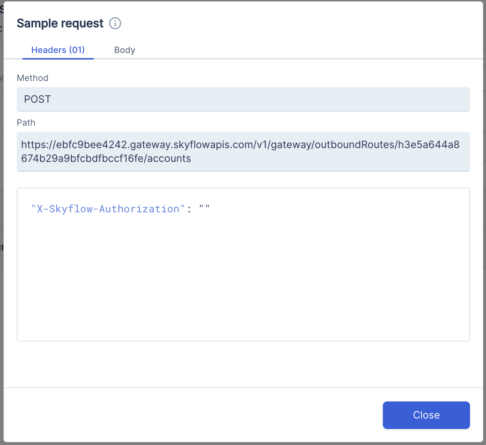
</p>

#### Testing the result

1. From the same terminal that you exported your environment variables, enter the following command:

```shell
npm run dev
```
1. Navigate to `https://localhost:3000` in your browser.
1. Go through the various screens until you reach the **Set up direct deposit** screen.
1. Click the **Continue** button.
1. The page will not complete, but if you’ve done everything correctly, the Moov account for your shopper should have been created. Log into the Moov admin dashboard and under **Accounts **you should see the shopper name and email listed.

### Creating the Moov bank account

Now that your shopper has a Moov account, you need to collect the shopper’s bank information, store it in the vault, and then use your other connection route to pass the bank information securely to Moov.

#### Understanding the code

1. Open the [pages/banking-info.js](/baseline/pages/banking-info.js) file and find the `bankingHandler` function again.
1. Find the `// TODO` inside the `bankingHandler` and replace it with the code below.

```javascript
const skyflowClient = Skyflow.init({
  vaultID: process.env.vaultID,
  vaultURL: process.env.vaultURL,
  getBearerToken: getBearerToken,
  options: {
    env: Skyflow.Env.DEV
  }
});

// Save bank information to the vault.
let response = await skyflowClient.insert({
  records: [
    {
      fields: {
        bank_account_number: this.state.accountNumber,
        bank_routing_number: this.state.routingNumber,
        shoppers_skyflow_id: skyflowId,
        account_holder_name: this.state.holderName
      },
      table: 'shoppers_bank_information'
     }
   ]
 }, { tokens: true });

// Create the Moov bank account.
const result = await fetch('/api/moov-bank-account-creation', {
  body: JSON.stringify(response.records[0]),
  headers: {
    'Content-Type': 'application/json'
  },
  method: 'POST'
});

const payload = await result.json();
if(payload.ok === true) {
  window.location.href = '/congratulations';
}
```

1. Similar to the code you added for storing the shopper account information in the vault, this code is storing the banking information in the vault and receiving tokens back. The tokens are then posted to the `/api/moov-bank-account-creation` endpoint.
1. Open the file [pages/api/moov-bank-account-creation.js](/baseline/pages/api/moov-bank-account-creation.js). This handler accepts the tokens representing the banking information from the shopper and securely shares them with Moov via the second route you created earlier.
1. Scroll down to the line beginning with `let connectionsRouteUrl`. Update this URL to the Moov Bank Account Creation route URL. Make sure that you replace the `{accountId}` portion in the URL with the `moovAccountId` constant similar to the following:

```javascript
let connectionsRouteUrl = `https://ebfc9bee4242.gateway.skyflowapis.com/v1/gateway/outboundRoutes/h3e5a644a8674b29a9bfcbdfbccf16fe/accounts/${moovAccountId}/bank-accounts`;
```

#### Testing the result

1. From the same terminal that you exported your environment variables, enter the following command:

```shell
npm run dev
```

1. Navigate to `https://localhost:3000` in your browser.
1. Go through the various screens until you reach the **Set up direct deposit** screen.
1. Fill in the **Holder name** with anything you wish.
1. For the **Routing number**, enter 322271627, which is Chase Bank’s routing number.
1. For the **Account number**, enter 0004321567000, which is a valid test bank account number for Moov.
1. Click the **Continue** button.
1. Once the page successfully displays the Congratulations page, go back into Skyflow Studio and check the shoppers_bank_information table, you should see a new record written there. Additionally, if you look at the latest account in your Moov admin dashboard, you should see a payment method listed under the account information.

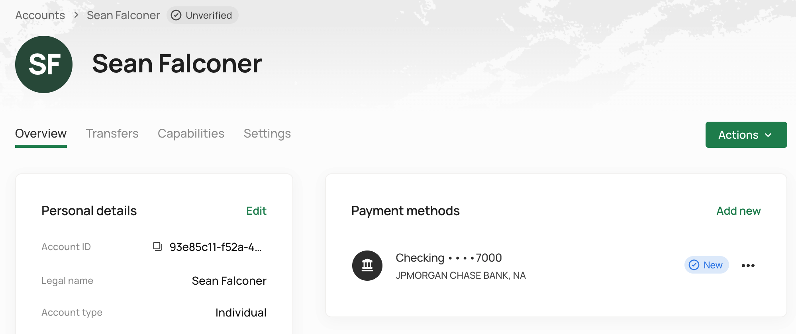

## Pay your gig workers

Congratulations! You’re nearly done.

All you need to do now is to make sure your shopper’s get paid. The Instabread shopper app is set up to automatically owe the shopper $64.00 for completed deliveries. In this section, you’ll add the final piece of client-side code to securely issue a transaction to pay the shopper.

### Understanding the code

1. Open the [pages/cashout.js](/baseline/pages/cashout.js) file. This is the frontend code for confirming that a shopper wants to cashout the money they’ve earned.
1. Scroll down to the `cashOutHandler`. This function is called when you click on the **Cashout $64.00** button. It currently makes an API call to the `/api/cashout` endpoint.
1. Open the [pages/api/cashout.js](/baseline/pages/api/cashout.js) file. Currently this handler function doesn’t do anything. We need to add the Moov API calls to carry out a money transfer. We can use the Moov APIs directly rather than through Skyflow because none of the data required to perform a transaction contains sensitive customer data.
1. Copy the code below and replace the `// TODO` line in the `handler` function.

```javascript
// Get the source payment method ID. The source is the Instabread business account.
const businessPaymentMethodId = await
  getPaymentMethodId(process.env.MOOV_BUSINESS_ACCOUNT_ID, 'ach-debit-fund');

// Get the destinatino payment method ID. The destination is the shopper's account.
const destinationPaymentMethodId = await getPaymentMethodId(req.session.moovAccountId,
     'ach-credit-standard');

// Set the scopes for a transfer.
await moov.generateToken([SCOPES.TRANSFERS_WRITE, SCOPES.BANK_ACCOUNTS_READ],
  req.session.moovAccountId);

const transfer = {
  source: { paymentMethodID: businessPaymentMethodId },
  destination: { paymentMethodID: destinationPaymentMethodId },
  amount: {
    value: 6400, // $64.00
    currency: 'USD'
  },
  description: 'instabread shopper fees'
};

// Execute the transfer from Instabread to the shopper.
await moov.transfers.create(transfer);
```

The code uses a helper function called `getPaymentMethodId`, which uses the Moov APIs to look up the payment method ID that will be used in the account transfer call. Once the two ID values are retrieved, the money transfer object is created and the transfer is invoked via the Moov Node SDK.

### Testing the result

1. From the same terminal that you exported your environment variables, enter the following command:

```shell
npm run dev
```
1. Navigate to `https://localhost:3000` in your browser.
1. Go through the various screens until you reach the **Set up direct deposit** screen.
    1. Fill in the **Holder name** with anything you wish.
    1. For the **Routing number**, enter 322271627, which is Chase Bank’s routing number.
    1. For the **Account number**, enter 0004321567000, which is a valid test bank account number for Moov.
1. Click the **Continue** button.
1. Click **Continue to my home screen**, then **Cashout $64.00**, and finally **Cashout $64.00** again on the **Instant checkout** screen. If everything worked, you should see a screen saying “Transferring $64.00 to your bank account ending in 7000”.

If you go back into the Moov admin dashboard to your shopper’s account and then click the **Transfer** tab, you should see something similar to the image below.

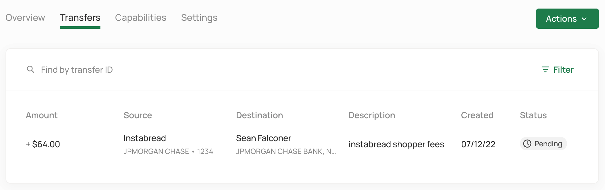

## Wrapping up

Congratulations on completing the data privacy and payments codelab!

You successfully created a gig worker sign up and payment process that safely collects PII and ACH information and issues money movement transfers through Moov.

### What’s next?

* Currently, the cashout screens don’t display any information about the bank account where the money will be deposited. Take a look [reading data from a vault](https://docs.skyflow.com/core-apis/#read-data-from-the-vault) guide to explore how you could display just the last four digits of the bank account number in the cashout UI.
* The tokenized data is stored within the application session. Ideally, this would be stored in your application database. Try extending Instabread to integrate with an application database and even a data warehouse.

### Further reading

* Learn more about how to govern access to your vault with the [Data governance overview](https://docs.skyflow.com/data-governance-overview/) guide.
* Review additional information about connecting to third-party systems with the [Connections overview](https://docs.skyflow.com/connections-overview/) guide.
* Check out the [Security best practices checklist](https://docs.skyflow.com/security-best-practices-checklist/) to learn more about how to keep data secure.

### Reference docs

* Skyflow:
    * [Insert Record](https://docs.skyflow.com/record/#RecordService_InsertRecord)
* Moov:
    * [Create account](https://docs.moov.io/api/#operation/createAccount)
    * Create [bank account](https://docs.moov.io/api/#operation/bankAccount)
    * [Create a transfer](https://docs.moov.io/api/#operation/createTransfer)
    * [Get payment methods](https://docs.moov.io/api/#tag/Payment-methods)
